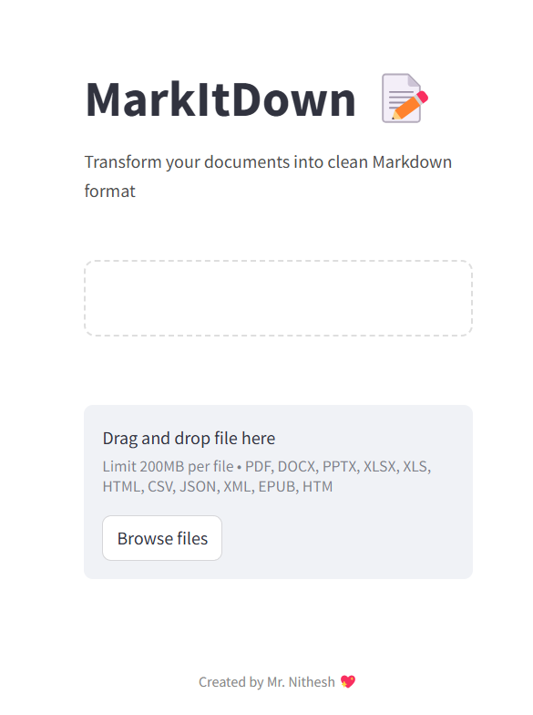

# MarkItDown Document Converter

A web application that converts various document formats to Markdown using the MarkItDown library.



## Features

- Convert multiple file formats to Markdown, including:
  - PDF
  - Microsoft Office documents (DOCX, PPTX, XLSX, XLS)
  - Web documents (HTML)
  - Data files (CSV, JSON, XML)
  - E-books (EPUB)
- Clean, intuitive web interface
- Instant preview of converted Markdown
- One-click download of converted files

## Installation

1. Clone this repository:
   ```bash
   git clone https://github.com/mrnithesh/mark-it-down.git
   cd mark-it-down
   ```

2. Install the required dependencies:
   ```bash
   pip install -r requirements.txt
   ```

## Usage

1. Run the Streamlit application:
   ```bash
   streamlit run app.py
   ```

2. Open your web browser and navigate to the URL displayed in the terminal (typically http://localhost:8501)

3. Upload a supported document through the file uploader

4. Once conversion is complete, you can:
   - View the Markdown preview
   - Download the converted Markdown file

## Technology Stack

- [Python](https://www.python.org/)
- [Streamlit](https://streamlit.io/) - Web interface framework
- [MarkItDown](https://github.com/microsoft/markitdown/) - Document conversion library

## License

This project is licensed under the MIT License - see below for details:

```
MIT License

Copyright (c) 2025 Nithesh K

Permission is hereby granted, free of charge, to any person obtaining a copy
of this software and associated documentation files (the "Software"), to deal
in the Software without restriction, including without limitation the rights
to use, copy, modify, merge, publish, distribute, sublicense, and/or sell
copies of the Software, and to permit persons to whom the Software is
furnished to do so, subject to the following conditions:

The above copyright notice and this permission notice shall be included in all
copies or substantial portions of the Software.

THE SOFTWARE IS PROVIDED "AS IS", WITHOUT WARRANTY OF ANY KIND, EXPRESS OR
IMPLIED, INCLUDING BUT NOT LIMITED TO THE WARRANTIES OF MERCHANTABILITY,
FITNESS FOR A PARTICULAR PURPOSE AND NONINFRINGEMENT. IN NO EVENT SHALL THE
AUTHORS OR COPYRIGHT HOLDERS BE LIABLE FOR ANY CLAIM, DAMAGES OR OTHER
LIABILITY, WHETHER IN AN ACTION OF CONTRACT, TORT OR OTHERWISE, ARISING FROM,
OUT OF OR IN CONNECTION WITH THE SOFTWARE OR THE USE OR OTHER DEALINGS IN THE
SOFTWARE.
```

## Credits and Acknowledgements

- [MarkItDown](https://github.com/microsoft/markitdown/) - This project uses the MarkItDown library for document conversion functionalities. Please refer to the MarkItDown repository for more information about its license and usage.
- All trademarks, logos, and brand names are the property of their respective owners.

## Contributing

Contributions are welcome! Please feel free to submit a Pull Request.

1. Fork the repository
2. Create your feature branch (`git checkout -b feature/amazing-feature`)
3. Commit your changes (`git commit -m 'Add some amazing feature'`)
4. Push to the branch (`git push origin feature/amazing-feature`)
5. Open a Pull Request
